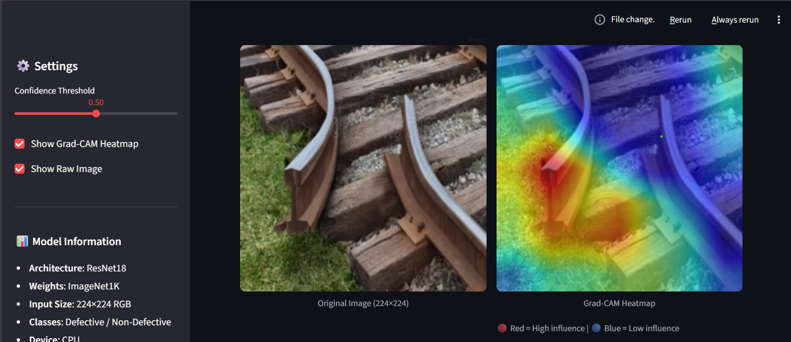

# Track-fix: Explainable Railway Surface Defect Classification

An industrial-grade **explainable deep learning system** for automated railway surface defect classification using Gradient Class Activation Mapping.  
The system classifies railway track images into **Defective** and **Non-Defective** categories and generates **Grad-CAM heatmaps** to explain model decisions.

---

## 📌 Project Overview

This project implements a convolutional neural network (CNN) based crack detection pipeline using **ResNet18** with transfer learning.  
Explainability is achieved using **Gradient-weighted Class Activation Mapping (Grad-CAM)**, enabling visualization of regions influencing the classification output.

---

## 🎯 Objectives

- Develop an accurate railway crack classifier  
- Apply transfer learning using pretrained CNNs  
- Integrate explainable AI (Grad-CAM)  
- Support batch image processing  
- Provide industrial-style result logging  

---

## 🧠 Model Architecture

- Backbone: ResNet18 (pretrained on ImageNet)  
- Modified final layer: 2-class output  
- Input size: 224 × 224 RGB  

---

## 🧰 Frameworks & Libraries

- PyTorch  
- Torchvision  
- OpenCV  
- NumPy  
- Pillow  
- Scikit-learn  
- pytorch-grad-cam  

---

## 📁 Dataset Structure

Dataset/
├── Train/
│ ├── Defective/
│ └── Non_defective/
├── Validation/
│ ├── Defective/
│ └── Non_defective/
└── Test/

Binary labels:

- 0 → Defective  
- 1 → Non_defective  

Dataset size: ~2 GB

---

## 🔁 Workflow Pipeline

Dataset
↓
Preprocessing
↓
ResNet18 Training
↓
Model Saved (.pth)
↓
Image Testing
↓
Grad-CAM Heatmap Generation
↓
Batch Processing & Reports

---

## 🏋️ Training Configuration

- Epochs: 10  
- Batch size: 16  
- Optimizer: Adam  
- Learning rate: 0.0001  
- Loss function: Cross-Entropy  
- Device: CPU  

---

## 📉 Training Log

| Epoch | Loss |
|------:|------|
| 1 | 0.4892 |
| 2 | 0.0797 |
| 3 | 0.0343 |
| 4 | 0.0152 |
| 5 | 0.0049 |
| 6 | 0.0057 |
| 7 | 0.0038 |
| 8 | 0.0097 |
| 9 | 0.0032 |
| 10 | 0.0030 |

---

## ✅ Validation Performance

Validation Accuracy: **93.55%**

---

## 🧪 Testing Procedure

1. Place image(s) inside `test/` folder  
2. Run prediction script  
3. Observe predicted class  
4. Run Grad-CAM script  
5. Inspect generated heatmaps  

---

## 🔍 Explainability (Grad-CAM)

- Heatmaps highlight **regions influencing model decisions**
- Heatmap presence does **not necessarily indicate a defect**
- For non-defective images, model highlights structural regions (rails, fasteners) to confirm normal condition

---

## 🧪 Experimental Results

### Defective Images

- 150 images tested  
- 150 correctly classified  
- Accuracy: 100%

  
  

### Non-Defective Images

- 150 images tested  
- 150 correctly classified  
- Accuracy: 100%  

Heatmaps appeared on both classes, representing attention regions.

---

## 🏭 Industrial Comparison

| System Type | Typical Accuracy |
|------------|----------------|
| Traditional CV | 60–75% |
| Basic CNN | 80–90% |
| Industrial Prototype | 90–95% |
| Safety-Certified Systems | 95–99% |

This project: **93.55% (Industrial Prototype Grade)**

---

## 📦 Model Artifact

- File: `rail_crack_model.pth`  
- Size: ~45 MB  

---

## ⚠️ Limitations

- Classification only (no bounding boxes)  
- Grad-CAM attention may be broad  
- CPU training time high  

---

## 🚀 Future Work

- YOLO-based crack localization  
- Video stream processing  
- Hyperparameter tuning  
- GUI dashboard  
- Edge deployment  

---

